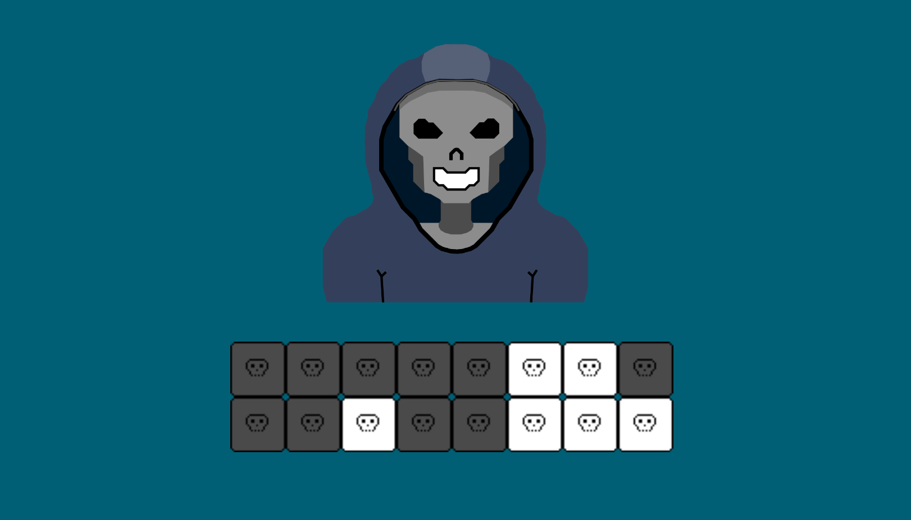
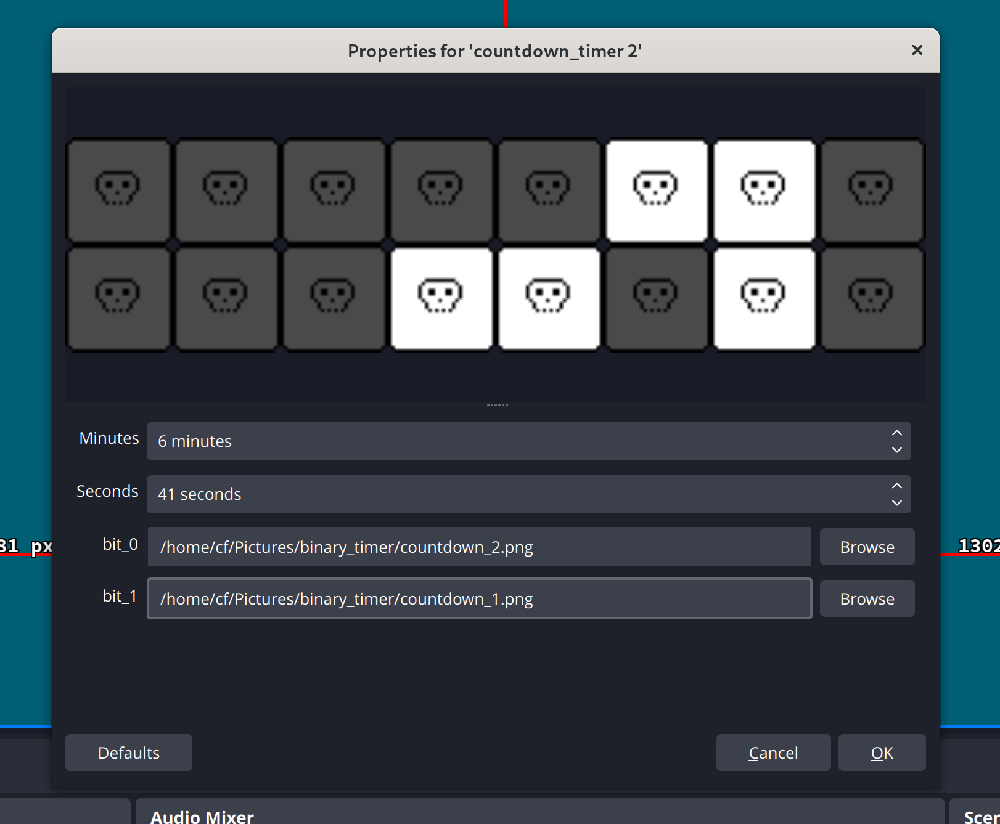

# countdown binary timer

Hello. This is an obs countdown timer plugin.



Set parameters such as minutes and seconds. Set image for bit 0 and bit 1.



# Build

```
mkdir build
cd build
cmake ..
make
sudo cp src/libcountdown_binary.so /usr/lib64/obs-plugins/
```
